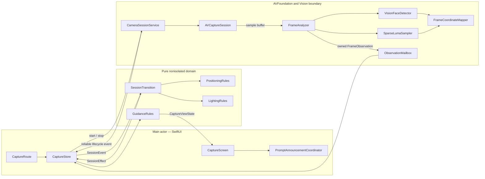
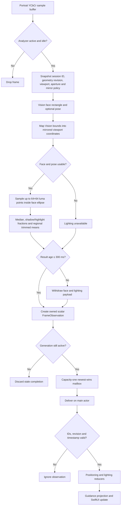

# Guided Face Tracking for iOS

Guided Face Tracking is a native iPhone application that uses the front camera to help a person position their face and improve scene lighting in real time. It presents a mirrored portrait preview, guides the user into a stable alignment, then follows the face while offering advisory lighting feedback.

The implementation is deliberately local and ephemeral: frames are analyzed in memory and are not recorded, persisted, uploaded, or used for recognition. The application captures no audio and makes no identity, liveness, medical, or certified-quality claim.

## Functional overview

The experience has two behavioral stages:

1. **Aligning** — the user places their face inside a fixed target. Position, size, pose, continuity, and stability must remain eligible for 2,000 ms before acquisition.
2. **Following** — the fixed guide remains visible while a raw, current face outline follows the detected face. Temporary face loss keeps the app in following mode; an explicit restart begins a new alignment attempt.

Positioning guidance has priority over lighting guidance. Lighting is evaluated only when face geometry and pose are eligible, and is presented as advisory feedback: acceptable, too dark, too bright, uneven, or high contrast. Hysteresis and time-based persistence prevent noisy frame-to-frame changes.

The UI also handles camera authorization, interruption, recoverable camera or detector failures, tracking loss, Dynamic Type, VoiceOver announcements, and Reduce Motion.

## Architecture

The design separates framework integration from deterministic behavior. Camera and Vision code produce small owned values; pure reducers decide state transitions; the main-actor store publishes an immutable presentation projection.



### State and effects

`SessionTransition` is the lifecycle authority. It consumes typed events and returns a new `SessionState` plus an ordered list of effects. The reducer owns authorization eligibility, route and scene activity, session generations, geometry revisions, acquisition/following state, freshness, interruption, failure, retry, restart, and exit behavior.

This reducer/effect boundary provides two important guarantees:

- Framework callbacks cannot directly revive or mutate a stale attempt.
- Stop/start ordering and timer scheduling are explicit and deterministic in tests.

Every camera attempt receives a monotonically increasing session ID. Viewport changes receive a geometry revision. Observations are accepted only when both values match the active state and their capture timestamp is newer than the last accepted sample.

### Analysis pipeline

Each accepted camera frame follows this pipeline:



Vision receives the physically portrait-oriented buffer with `.up`; the analyzer does not apply a second rotation. Face geometry and raw luma sample points share one immutable `FrameTransformSnapshot`, including clean aperture, aspect-fill crop, and the preview's single mirror operation. This keeps the drawn face and lighting regions in the same coordinate system.

Luma analysis reads plane zero directly from supported 8-bit bi-planar YCbCr buffers. It does not create `UIImage` or RGB copies. Pixel-buffer memory, Vision observations, and borrowed pointers remain inside the synchronous frame callback.

## Concurrency model

The target uses Swift 6 complete concurrency checking with nonisolated default actor isolation. Ownership is split across three execution domains:

| Domain | Owner | Responsibilities |
| --- | --- | --- |
| Main actor | `CaptureRoute`, `CaptureStore`, SwiftUI views, accessibility coordinator | UI lifecycle, reducer event serialization, effect dispatch, observable presentation state |
| Serial camera queue | `CameraSessionService` | Session configuration, start/stop, notification handling, active generation, teardown |
| Serial output queue | `FrameAnalyzer` | One-at-a-time Vision detection, coordinate mapping, luma sampling, observation creation |

```mermaid
sequenceDiagram
    participant UI as MainActor / CaptureStore
    participant CQ as cameraQueue
    participant AV as AVCaptureSession
    participant OQ as outputQueue / FrameAnalyzer
    participant MB as ObservationMailbox

    UI->>CQ: start(context, handlers)
    CQ->>AV: configure and startRunning()
    CQ-->>UI: started(sessionID, selection)

    loop Camera frames
        AV->>OQ: didOutput(sampleBuffer)
        alt analyzer already busy
            OQ-->>OQ: discard late frame
        else analyzer available
            OQ->>OQ: Vision + transform + luma
            OQ->>MB: publish(FrameObservation)
            Note over MB: capacity 1; newest pending value wins
            MB-->>UI: deliver owned scalar observation
            UI->>UI: validate generation and reduce synchronously
        end
    end

    UI->>UI: invalidate active generation
    UI->>CQ: stop(old sessionID)
    CQ->>OQ: invalidate analyzer and mailbox
    CQ->>AV: stopRunning()
    CQ-->>UI: stopped(old sessionID)
```

The frame path is intentionally lossy: `ObservationMailbox` retains at most one pending observation and schedules at most one drain. This provides backpressure without blocking camera delivery. Camera failures, interruptions, starts, stops, and media-services resets use a separate reliable control-event path.

The shared `AVCaptureSession` crosses isolation only through an immutable `CameraPreviewSession` wrapper. The camera queue exclusively mutates configuration and running state; the main actor only attaches the session to `AVCaptureVideoPreviewLayer`.

Timers use injected monotonic milliseconds. The current provisional profile expires face data after 300 ms, resets continuity after gaps greater than 300 ms, and reports an analysis stall after more than 5,000 ms. Timer events can withdraw stale state or fail an attempt, but cannot acquire a face—acquisition requires a fresh eligible observation.

## Guidance and presentation

The domain layer emits presentation-ready values rather than localized strings or SwiftUI state:

- `PositioningRules` evaluates location, scale, pose, continuity, and time-based smoothing.
- `LightingMeasurement` and `LightingRules` derive aggregate luminance metrics, classify lighting, and apply entry/exit hysteresis and persistence.
- `GuidanceRules` gives positioning priority, selects lighting advice, and projects mask, return-guide, tracked-oval, and badge state.
- `CaptureViewState` and typed key mappings bridge domain state into localized SwiftUI presentation.

VoiceOver prompt announcements are keyed, deduplicated, and coalesced to at most one announcement every 1,200 ms. Decorative guide eyes and the moving face outline are hidden from accessibility; the fixed guide and lighting badge expose complete labels. Reduce Motion removes presentation fades without changing acquisition or persistence timing.

## Repository layout

```text
facetracking/
├── App/         Composition root and dependency wiring
├── Camera/      AVFoundation, Vision, transforms, mailbox, luma sampling
├── CaptureUI/   Main-actor store, SwiftUI presentation, accessibility
├── Tracking/    Pure state, reducers, rules, models, configuration
└── Resources/   String catalog and visual assets

facetrackingTests/    Deterministic unit and lifecycle tests
facetrackingUITests/  Camera-free UI and accessibility scenarios
```

## Verification

The test architecture mirrors production boundaries. Pure reducers use explicit timestamps and synthetic observations; camera lifecycle tests use injected services; UI tests launch DEBUG-only fake scenarios that never construct the live camera service. No test relies on sleeping to advance acquisition, freshness, persistence, or announcement time.

Typical commands, with a discovered simulator ID, are:

```sh
DEVELOPER_DIR=/Applications/Xcode.app/Contents/Developer \
  xcodebuild -project facetracking.xcodeproj -scheme facetracking \
  -destination 'platform=iOS Simulator,id=<SIMULATOR_UDID>' \
  -only-testing:facetrackingTests test

DEVELOPER_DIR=/Applications/Xcode.app/Contents/Developer \
  xcodebuild -project facetracking.xcodeproj -scheme facetracking \
  -destination 'platform=iOS Simulator,id=<SIMULATOR_UDID>' \
  -only-testing:facetrackingUITests test

DEVELOPER_DIR=/Applications/Xcode.app/Contents/Developer \
  xcodebuild -project facetracking.xcodeproj -scheme facetracking \
  -destination 'generic/platform=iOS' CODE_SIGNING_ALLOWED=NO build
```

Physical-device validation remains necessary for camera permission behavior, preview geometry, real Vision pose availability, lighting calibration, VoiceOver quality, latency, thermal behavior, and lifecycle behavior under lock/background/Control Center transitions.
